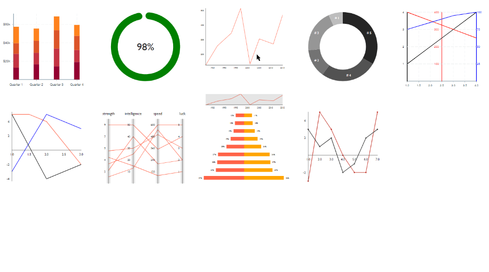

# Victory Charting Library for React.js

[Victory](https://formidable.com/open-source/victory/) - React.js components for modular charting and data visualization. Check out the [official documentation](https://formidable.com/open-source/victory/docs/) for more details.


## Getting Started

Clone down the repo, run an `npm install` to install dependencies, and then use `npm start` to run the Webpack server. The server will run at `localhost:8080`.





## Project Structure

I am going to start with an index page that will collect all my diagrams before handing the code over the Webpack:


`src\js\index.js`

```js
import React from 'react'
import ReactDOM from 'react-dom'

import BarChart from './components/barchart'

class Main extends React.Component {
  render() {
    return (
      <div>
        <h1>Google Analytics</h1>
        <BarChart />
      </div>
    );
  }
}

const app = document.getElementById('app');
ReactDOM.render(<Main />, app);
```


The first component that is imported here is a bar chart I took from the [Victory tutorial on Github](https://github.com/FormidableLabs/victory-tutorial):


`src\js\components\barchart.js`

```js
import React from 'react'
import { VictoryBar, VictoryChart, VictoryAxis, VictoryTheme, VictoryStack } from 'victory'

const data2012 = [
  {quarter: 1, earnings: 13000},
  {quarter: 2, earnings: 16500},
  {quarter: 3, earnings: 14250},
  {quarter: 4, earnings: 19000}
];

const data2013 = [
  {quarter: 1, earnings: 15000},
  {quarter: 2, earnings: 12500},
  {quarter: 3, earnings: 19500},
  {quarter: 4, earnings: 13000}
];

const data2014 = [
  {quarter: 1, earnings: 11500},
  {quarter: 2, earnings: 13250},
  {quarter: 3, earnings: 20000},
  {quarter: 4, earnings: 15500}
];

const data2015 = [
  {quarter: 1, earnings: 18000},
  {quarter: 2, earnings: 13250},
  {quarter: 3, earnings: 15000},
  {quarter: 4, earnings: 12000}
];

class BarChart extends React.Component {
  render() {
    return (
      <div>
        <VictoryChart
          domainPadding={10}
          theme={VictoryTheme.material}
        >
          <VictoryAxis
            tickValues={["Quarter 1", "Quarter 2", "Quarter 3", "Quarter 4"]}
          />
          <VictoryAxis
            dependentAxis
            tickFormat={(x) => (`$${x / 1000}k`)}
          />
          <VictoryStack
            colorScale={"warm"}
          >
            <VictoryBar
              data={data2012}
              x={"quarter"}
              y={"earnings"}
            />
            <VictoryBar
              data={data2013}
              x={"quarter"}
              y={"earnings"}
            />
            <VictoryBar
              data={data2014}
              x={"quarter"}
              y={"earnings"}
            />
            <VictoryBar
              data={data2015}
              x={"quarter"}
              y={"earnings"}
            />
          </VictoryStack>
        </VictoryChart>
      </div>
    );
  }
}

export default BarChart
```


When you start Webpack all of this code is bundled into `dist\bundle.js` (as defined in `webpack.config.js`) and imported as vanilla javascript into `dist\index.html`. This HTML file is then served to your browser on `localhost:8080`.


## Styled Components

When you start adding more [Victory Examples](https://formidable.com/open-source/victory/gallery/) you probably want to add some styling. A quick way to add a grid is [react-css-grid](https://github.com/jxnblk/react-css-grid):


```bash
npm install react-css-grid
```


All you have to do is to wrap the Grid component around your charts and define the column and gap size size:


`src\js\index.js`

```js
import React from 'react'
import ReactDOM from 'react-dom'
import Grid from 'react-css-grid'

import BarChart from './components/barchartDemo.jsx'
import CircularProgress from './components/circularProgressDemo.jsx'
import ZoomChart from './components/zoomChartDemo.jsx'
import CircularTooltip from './components/circularTooltip.jsx'
import MultiDepChart from './components/multipleDependencyChartDemo.jsx'
import MultiTooltipChart from './components/multipointTooltipDemo.jsx'
import ParalellBrushChart from './components/paralellBrushDemo.jsx'
import CentralAxisChart from './components/centralAxisDemo.jsx'
import GroupedTooltipChart from './components/groupedTooltipsDemo.jsx'

class Main extends React.Component {
  render() {
    return (
      <Grid
        width={320}
        gap={24}>
        <BarChart />
        <CircularProgress />
        <ZoomChart />
        <CircularTooltip />
        <MultiDepChart />
        <MultiTooltipChart />
        <ParalellBrushChart />
        <CentralAxisChart />
        <GroupedTooltipChart />
      </Grid>
    );
  }
}

const app = document.getElementById('app');
ReactDOM.render(<Main />, app);
```

